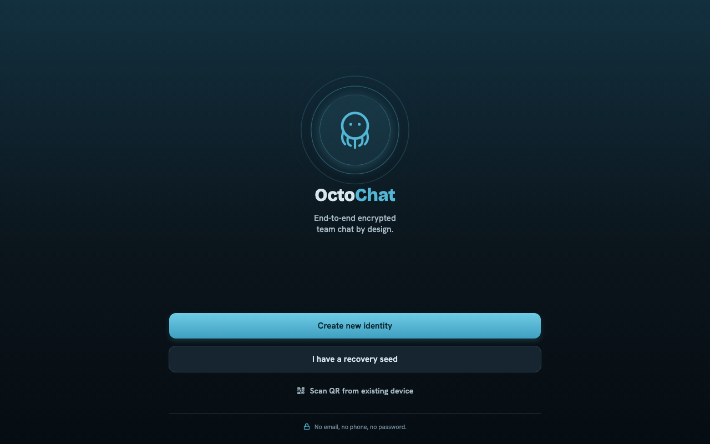
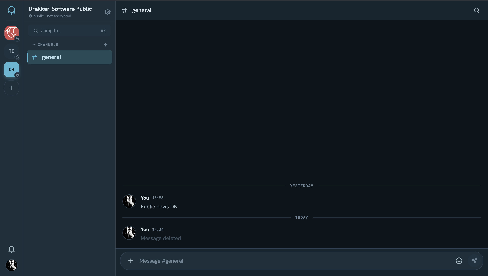

# 🐙 OctoChat

**End-to-end-encrypted team chat that runs everywhere — and trusts no one with your messages.**

OctoChat is a Slack/Mattermost-style chat with a marine, "paper-on-subaqua" soul.
One codebase ships to **iOS, Android, web, and desktop** — and every message,
attachment and room is sealed with real end-to-end encryption before it ever
leaves your device. The server syncs ciphertext it can't read.

> [!NOTE]
> **OctoChat is a proof of concept.** It exists to show what you can build on
> top of [**Starfish**](https://github.com/Drakkar-Software/Starfish) — the
> end-to-end-encrypted sync engine that powers identities, capabilities,
> keyrings and live sync here. Treat it as a reference app and a demo, not a
> production-ready product (yet).

<p align="center">
  
  &nbsp;&nbsp;
  
</p>

---

## ✨ Why OctoChat

- 🔒 **Real E2EE, not a checkbox.** Onboarding turns a BIP-39 seed phrase into
  Ed25519 + Kyber keys (kept in your device's secure storage). Messages and
  files are sealed per-room with space keyrings. The backend only ever sees
  ciphertext.
- 🌍 **Truly universal.** One Expo codebase → native iOS & Android, the web, and
  an Electron desktop app. No "mobile vs. web" fork.
- ⚡ **Live by default.** REST for sync, SSE for the firehose — new messages,
  presence and activity stream in over a NATS-backed gateway.
- 🎨 **A theme with a point of view.** Marine palette, octopus mark, Bricolage +
  Hanken + JetBrains Mono. Light and dark, every constant from a single source.
- 🔑 **Multi-device, multi-account, no passwords.** Hold several accounts and
  switch live; pair a new device from your seed (passkeys gate sensitive
  enrollment), or sign in with a **NIP-07** Nostr extension.
- 📴 **Offline-first.** Rooms and profiles are served from a local pull cache, so
  the app opens and reads instantly even with no connection — an offline banner
  shows when you're disconnected.

## 💬 What you can do

- **Spaces & channels** — public or private, with categories and per-room unread.
- **Threads** — reply in-thread anywhere; a dedicated Threads tab gathers every
  thread in the active space, decrypted across rooms.
- **1:1 direct messages** — encrypted private conversations with another member.
- **Explore** — a directory of public spaces you can discover and join.
- **Automations & bots** — automated rooms driven by scheduled fetches or
  slash-command bots, plus append-only "stream" rooms for easy bot push (see the
  runnable [`examples/`](examples/README.md)).
- **Rich notifications** — real-content push on Android (FCM), per-room grouping,
  taps that route straight to the room; you never get pinged for your own posts.
- **Files** — drag-and-drop attachments (web), native share & save; every blob
  sealed client-side before upload.

## 🔒 Security & encryption

OctoChat is **end-to-end encrypted by design**: plaintext exists only on your
devices. The server is treated as untrusted infrastructure — it stores and
relays opaque ciphertext, and never holds a key that could open it.

- **Your seed is the master key.** A 12-word BIP-39 recovery phrase
  (128 bits of entropy) is stretched with **Argon2id** into your root identity:
  an **Ed25519** signing keypair and a **Kyber/ML-KEM** key-encapsulation
  keypair. The same words deterministically recover everything — so the words
  are the secret, and they never leave your device or touch the server.
- **Per-space keyrings seal every message.** Each space has one keyring whose
  content-encryption key (CEK) seals all of its channels with **AEAD
  (AES-GCM)**. Messages *and* attachments are sealed client-side before upload;
  attachment seals even bind the storage path into their AAD, so a hostile
  server can't swap or relocate a blob.
- **Capabilities, not accounts.** There are no passwords on the server. Every
  request is signed by your device key and authorized against a scoped
  **capability certificate** (cap-cert). Joining a space hands you a
  space-scoped member cap; the server grants access only to what your caps
  prove you're entitled to.
- **Forward-moving membership.** Adding a member rotates into a new keyring
  epoch — new members can read messages from when they joined onward, not your
  whole history.
- **Encrypted at rest, everywhere.** On native, keys live in the OS secure
  store (`expo-secure-store` / Keychain / Keystore). On web, seeds are *never*
  written in cleartext: an AEAD vault is sealed under a random master key, which
  is itself wrapped by a PIN (Argon2id-stretched) and, optionally, a **WebAuthn
  passkey** PRF secret. A disk scraper recovers only ciphertext.
- **Sealed device pairing.** Adding a device provisions a key bundle, seals it
  with your PIN (Argon2id → AES-GCM), and drops it on a public rendezvous keyed
  by an unguessable CSPRNG nonce. The QR carries only the nonce plus your root
  pubkey, which the new device uses to pin the bundle — defence in depth on top
  of the PIN seal.

> The technical deep-dive — exact primitives, the cap model, key rotation and
> the authenticated SSE proxy — is in the
> [Encryption model](#encryption-model) section below.

## 🚀 Quick start

```bash
pnpm install
pnpm infra:up   # NATS in Docker
pnpm dev        # backend: Starfish :8787 + Whistlers SSE :8080
pnpm web        # the app, in your browser at :8081
```

That's it — open `localhost:8081` and create a space.

> Want native or desktop instead of web? `pnpm ios` · `pnpm android` · `pnpm desktop`.

---

# 🛠️ Developer guide

Everything below is the nuts-and-bolts reference: prerequisites, the full dev
loop, ports, commands and project layout.

## Prerequisites

- **Node.js** ≥ 20 (tested on 24)
- **pnpm** 10 — `npm i -g pnpm`
- **Docker** (or OrbStack) — for NATS

## Install

```
pnpm install
```

## Dev setup

Three services need to run. Open two terminals:

**Terminal 1 — infrastructure + backend**

```
pnpm infra:up   # start NATS in Docker (detached)
pnpm dev        # Starfish server :8787 + Whistlers SSE :8080
```

**Terminal 2 — frontend**

```
pnpm web        # Expo web  :8081
# or
pnpm ios        # Expo iOS simulator
pnpm android    # Expo Android emulator
pnpm desktop    # Electron wrapper
```

> **Whistlers restart.** `pnpm dev` starts Whistlers once — it does not watch
> for config changes. If you edit `infra/whistlers.config.json` or bump the
> `@drakkar.software/whistlers` package, kill and re-run `pnpm dev` (or
> `pnpm whistlers` on its own).

## Ports

| Service | Port | What |
|---|---|---|
| Expo / Metro | 8081 | Mobile/web app (dev) |
| Starfish server | 8787 | Sync API + `/events` SSE proxy |
| Whistlers | 8080 | Internal NATS→SSE gateway |
| NATS | 4222 | Message bus (Docker) |

## All commands

| Command | What |
|---|---|
| `pnpm infra:up` | Start NATS (Docker, detached) |
| `pnpm infra:down` | Stop all Docker services |
| `pnpm dev` | Starfish server + Whistlers (concurrently, with NATS URLs wired) |
| `pnpm whistlers` | Whistlers SSE gateway only |
| `pnpm dev:server` | Starfish server only (no NATS_URL set) |
| `pnpm web` | Expo web |
| `pnpm ios` | Expo iOS |
| `pnpm android` | Expo Android |
| `pnpm desktop` | Electron wrapper |
| `pnpm desktop:package` | Package Electron app |
| `pnpm typecheck` | TypeScript check all workspaces |
| `pnpm lint` | Lint all workspaces |

## Structure

```
apps/
  mobile/    — Expo SDK 56 app (@octochat/mobile)
  server/    — Hono Starfish server (@octochat/server)
  desktop/   — Electron wrapper (@octochat/desktop)
packages/
  sdk/       — @drakkar.software/octochat-sdk (headless chat-domain core)
  tsconfig/  — shared TypeScript base config
examples/    — standalone SDK-only bots (stream-publish-bot, stream-webhook-bot)
infra/
  whistlers-sse.mjs     — dev launcher for Whistlers (adds CORS)
  whistlers.config.json — Whistlers subscription config
docker-compose.yml      — NATS service
```

## Architecture

- **Crypto / sync** lives in the headless `@drakkar.software/octochat-sdk`
  (`packages/sdk`) — seed → keys, device pairing, per-room keyrings, the Starfish
  client. The app injects platform `kv`/config at boot
  (`apps/mobile/src/lib/octochat-init.ts`) and keeps only platform adapters under
  `apps/mobile/src/lib/starfish/*`.
- **SSE delivery** is documented in
  [`apps/server/docs/notifications-sse.md`](apps/server/docs/notifications-sse.md).
- **Design rules & conventions** for the app: see
  [`apps/mobile/CLAUDE.md`](apps/mobile/CLAUDE.md).

## Encryption model

The full encrypted sync layer lives in the headless
`@drakkar.software/octochat-sdk` (`packages/sdk`); the app supplies only platform
adapters under `apps/mobile/src/lib/starfish/*`, and the server (`apps/server`) is
a thin Starfish sync host plus an authenticated SSE proxy. Threat model: the server and transport are **untrusted** — they see
ciphertext, signed request envelopes and capability scopes, never plaintext or
private keys.

### Identity & keys (`identity.ts`, `client.ts`)

- A 12-word **BIP-39** mnemonic (128-bit entropy) is the only master secret.
  `bootstrapRootIdentity` stretches it with **Argon2id** into a root identity.
- Each device holds an **Ed25519** keypair (request signing, cap minting) and a
  **Kyber/ML-KEM** keypair (key encapsulation for keyring recipients).
- The bootstrap Argon2id runs **once** at sign-in; restore paths reuse cached
  device keys and only do fast Ed25519 cap-minting thereafter.

### Authorization: capability certificates (`paths.ts`, `member-caps.ts`)

- No server-side passwords or sessions. Every `/pull` and `/push` is signed
  (`signRequest`) by the device Ed25519 key.
- Access is gated by **scoped cap-certs**: a device cap for your own
  owner/account scopes, and a **member cap** (`mintMemberCap`) per joined space.
  The server authorizes a request only if a presented cap proves the scope.

### Message & attachment sealing (`members.ts`, `attachments.ts`)

- One **keyring per space** (`starfish-keyring`) covers every channel. Its CEK
  seals message bodies and attachment bytes with **AEAD (AES-GCM)** before they
  leave the client.
- Attachments are stored as opaque `application/octet-stream` blobs in a
  separate collection; the message doc keeps only a small `AttachmentRef`. The
  blob's storage path is bound into the seal's **AAD**, preventing a hostile
  server from swapping or relocating blobs.
- **Key rotation / epochs:** inviting a recipient (`addCollectionRecipient`,
  keyed by their KEM pubkey) advances the keyring epoch. A member sees content
  from their epoch forward; back-sealing old content is intentionally skipped.

### Device pairing (`pairing.ts`, `passkey.ts`)

- The existing device runs `provisionDevice`, seals the bundle with the user
  **PIN** (Argon2id → AES-GCM, `sealWithPassphrase`), and publishes it to a
  public `_pairing/<nonce>` rendezvous. The nonce is a 16-byte CSPRNG value —
  the only locator for the slot, so it must be unguessable.
- The QR payload is `nonce.rootEdPub`. The new device opens the blob with the
  PIN and pins the installed bundle to the QR-supplied root pubkey, rejecting a
  bundle minted by any other root even if the seal were opened by the wrong
  party.

### At-rest storage (`storage.ts`, `storage.native.ts`)

- **Native:** keys persist in `expo-secure-store` (Keychain / Keystore); the OS
  encrypts at rest.
- **Web:** `localStorage` holds only an AEAD envelope. All accounts live in one
  `Vault` sealed under a random 32-byte **Vault Master Key (VMK)** via AES-GCM;
  the VMK is wrapped by the PIN (Argon2id-stretched, ~20-bit secret) and
  optionally a **WebAuthn passkey** PRF secret (256-bit, keyed into AES-GCM
  directly). After unlock the VMK lives only in a module closure — not React
  state, not `sessionStorage`.

### Live events (`config.ts`, `apps/server`)

- The `/events` SSE endpoint is an **authenticated proxy**: it validates the
  caller's cap-cert identity and whitelists only their member spaces before
  relaying the Whistlers NATS→SSE stream. Event payloads are change
  notifications; message contents stay encrypted end-to-end.
